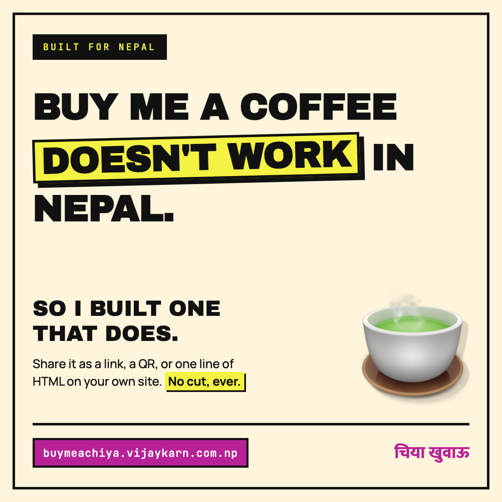

# Buy Me a Chiya · चिया खुवाऊ

A free tool that turns your eSewa, Khalti or bank details into a shareable tip page,
built for Nepal — where Buy Me a Coffee, Ko-fi and Patreon can't pay out because they
settle through Stripe or PayPal.

**buymeachiya.vijaykarn.com.np**

## How it works

There is no backend. `make.html` packs what you type into a base64url payload in the URL
fragment; `page.html` reads that fragment and renders the page. Nothing is sent to a
server, nothing is stored, and no account exists. The link *is* the page.

Supporters pay the creator's own account directly from their own banking or wallet app.
No money passes through this site, which is what keeps it out of Nepal Rastra Bank's
payment-service-provider regime.

## Embed it on your own site

Anyone can put their card on their own website with one tag:

```html
<script src="https://buymeachiya.vijaykarn.com.np/embed.js"
        data-chiya="YOUR_CODE"></script>
```

`YOUR_CODE` is the part of your page link after the `#`. Pasting the whole link works
too. Optional: `data-width="380px"` to change the maximum width (default `340px`).

The tag replaces itself with a sandboxed iframe pointing at `embed.html`, which reports
its height back so the card never clips. The embed loads no external fonts or
stylesheets, so it adds no third-party requests to the host page.



## Files

| File | Purpose |
|---|---|
| `index.html` | Landing page |
| `make.html` | Generator — builds the link |
| `page.html` | Renders a creator's page from the URL fragment |
| `embed.html` | Compact card rendered inside the iframe |
| `embed.js` | One-tag loader that hosts paste on their site |
| `terms.html`, `privacy.html` | Legal pages |
| `linkedin.png`, `linkedin-source.html` | Share image and the template it renders from |
| `style.css` | Shared styles for every page |

## Notes for anyone editing this

- **Never add an analytics script to `page.html`.** Payment details live in the address
  bar there, and most analytics tools report the full URL.
- Google Tag Manager (`GTM-KHF4Z8ST`) loads only on `index.html` and `make.html`.
  Anything added to that container inherits both pages, so check any new tag before
  publishing it.
- Making a link pushes `{ event: 'link_created' }` to the dataLayer. Add a Custom Event
  trigger named `link_created` in GTM to count it.
- `page.html` renders untrusted input from the fragment: use `textContent`, never
  `innerHTML`, and keep the https-only check on the QR image URL.

## Licence

MIT
